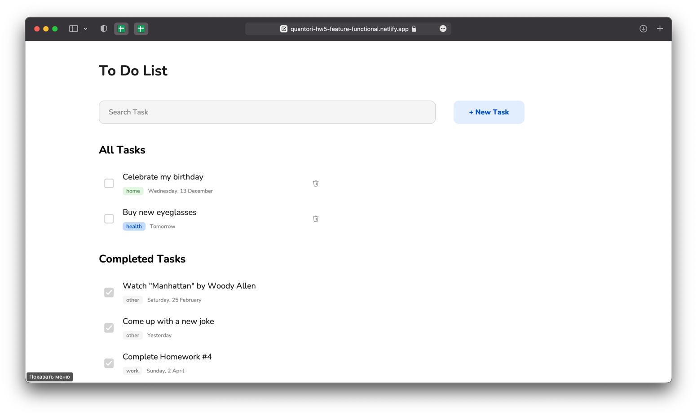
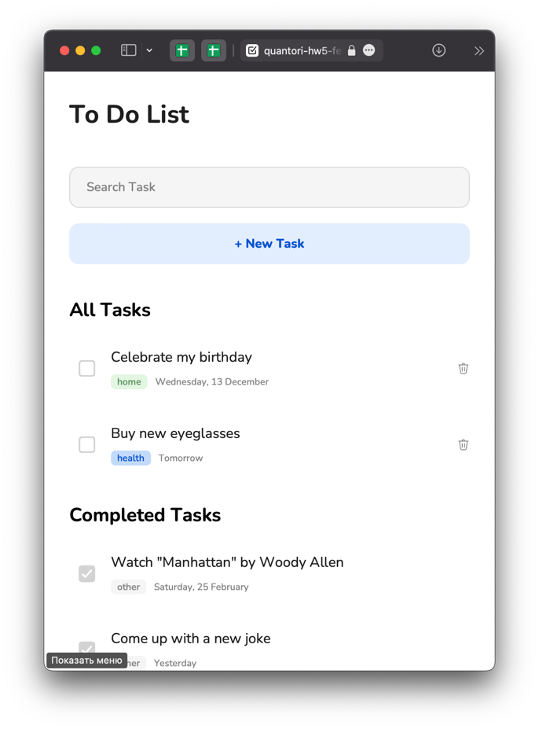

# Quantori Homework #5-7

---

### Homework 5

### Git, DOM, OOP

### Developed:

- [X] ToDo List with Functional Components
- [X] ToDo List with Class Components
- [X] Responsive design for all versions
- [X] Saving Task Items to the localStorage
- [X] Class Components saves state of children components

**Main Branch:** <a href="https://mordvintsevmv.github.io/quantori_homework_5" target="_blank">Open page</a>

**Description:** *The main branch of the app.*

---

**Functional ToDo Branch:** <a href="https://quantori-hw5-feature-functional.netlify.app/" target="_blank">Open page</a>

**Description:** *ToDo List using Functional Components.*

---

**Functional FLUX ToDo Branch:** <a href="https://quantori-hw5-feature-functional-flux.netlify.app/" target="_blank">Open page</a>

**Description:** *ToDo List using Functional Components with FLUX principle.*

---

**OOP ToDo Branch:** <a href="https://quantori-hw5-feature-oop.netlify.app/" target="_blank">Open page</a>

**Description:** *ToDo List using Class Components.*

---

### Homework 6

### Promises, Event Loop

### Developed:

- [X] Weather Widget
- [X] Fetching Data from server

**(HW6) OOP ToDo Branch:** <a href="https://quantori-hw6-feature-oop.netlify.app/" target="_blank">Open page</a>

**Description:** *ToDo List using Class Components.*

---

**(HW6) Functional ToDo Branch:** <a href="https://quantori-hw6-feature-functional.netlify.app/" target="_blank">Open page</a>

**Description:** *ToDo List using Functional Components.*

---

### Homework 7

### TypeScript

### Developed:

- [X] Webpack configuration
- [X] Using TypeScript syntax

**(HW7) OOP ToDo Branch:** <a href="https://quantori-hw7-feature-oop.netlify.app/" target="_blank">Open page</a>

**Description:** *ToDo List using Class Components.*

**App deployed from "build" folder**

---

**(HW7) Functional ToDo Branch:** <a href="https://quantori-hw7-feature-functional.netlify.app/" target="_blank">Open page</a>

**Description:** *ToDo List using Functional Components.*

**App deployed from "build" folder**

---

**The application was tested on a variety of devices (iOS, MacOS, Windows, Android) and browsers (Safari, Chrome, Firefox) manually.**

**More information about the components and solutions is provided in the documentation.**

---

## <a name="content">Content</a>

1. [Task](#Task)
2. [Project Structure](#structure)
3. [Technical Solutions](#solutions)
   1. [(HW5) Task Object](#solutions-taskobject)
   1. [(HW5) State and localStorage](#solutions-storage)
   1. [(HW5) Search Task](#solutions-search)
   1. [(HW5) Save state of children components (OOP)](#solutions-oop-state)
   2. [(HW5) Responsive Design](#solutions-responsive)
   2. [(HW6) Fetching Data from server](#solutions-fetching)
   2. [(HW6) Initializing tasks and weather](#solutions-init)
   2. [(HW7) Typing API functions](#solutions-typing)
4. [Components](#components)
5. [Contacts](#contacts)

---

## <a name="Task">Task</a>

**HomeWork 5:**

- [X] Develop the main functionality of the application:
  - Adding tasks;
  - Marking task as finished;
  - Deleting Task;
  - Searching for a task;
  - Storing tasks in the localStorage;
  - All other possible extensions.

**HomeWork 6:**

- [X] Create Weather Widget (Tbilisi weather as default);
- [X] Store tasks in the localhost DB.

**HomeWork 7:**

- [X] Add Webpack to the project;
- [X] Split the project into components;
- [X] Move the project to typescript.
   
---

## <a name="structure">Project Structure</a>

```
quantori_homework_5
│   README.md
│   404.html    
│   index.html    
│   og_image.png
│   .gitignore
│
└─── css - folder for all components style
│   │   Modal.css
│   │   Input.css
│   └─  ...
│   
└─── favicon - Favicons
│   │   favicon.ico
│   └─  ...
│
└─── functional - folder for all files of the Functional Components 
│   │   components - folder for all Components
│   └─  functional.js - all base functions for Functional Components
│
└─── oop - folder for all files of the Class Components
│   │   components - folder for all Components
│   └─  base_classes.js - base class for Class Components
│
└─── img - Images folder
│   │   checkbox-checked.svg
│   │   delete-new-value.svg
└   └─  ...
```

---

## <a name="solutions">Technical Solutions</a>

---

### <a name="solutions-taskobject">Task Object</a>

Before starting development, it was necessary to define the structure of the TaskItem object.

Example of an object:

```javascript
const item = {
    id: 0, // Unique ID
    isChecked: true, 
    title: 'Complete Homework #5', 
    tag: 'work', 
    date: new Date()
}
```
---

### <a name="solutions-storage">State and localStorage</a>

#### Functional 

In this approach, it was decided to use the global state object, 
which is defined when the application is first launched:

```javascript
let state = {
    items: task_items,
    last_id: task_items.reduce((max, item) => max > item.id ? max : item.id, task_items[0].id),
    isModal: false
}
```
*functional.js*


The **last_id** parameter is calculated by the maximum id of existing objects, 
so that Items do not have the same id.

The **isModal** parameter is used to determine whether the modal window is currently open.

It was also decided not to load items from localStorage at each rendering of the App Component, 
but to load them at the first launch (or use sample items if no data in localStorage):

```javascript
const task_items = load_items() || [
    {id: 0, isChecked: true, title: 'Complete Homework #5', tag: 'work', date: new Date()},
]
```
*functional.js*

All items are saved whenever the global state changes:

```javascript
export const useState = (initialValue = undefined) => {

    function setValue(newValue) {
        state = newValue;
        save_items(); // saving items in localStorage
        renderApp();
    }
}
```
*functional.js*

When rendering an App Component we get a global **state** and a function **setState** to change it using the useState() function.

```javascript
const App = () => {

    const [state, setState] = useState()
}
```
*App.js*

**Therefore:**
- When the application is first launched, a global state object is created with tasks from localStorage or sample tasks;
- All tasks are saved to localStorage every time the global state changes;
- The global state stores tasks, the state of the modal window, and other data (in different versions).

#### OOP

Everything is the same, except that the class approach allowed implement a state for each object. 
Therefore, the tasks are stored in the state of the App component and not in global state.

```javascript
class App extends Component {
    constructor() {
        super();
        this.state = {
            items: task_items,
            last_id: task_items.reduce((max, item) => max > item.id ? max : item.id, task_items[0].id),
            isModal: false,
            search_input: ''
        }
    }
}
```
*App.js*

It also allowed, for example, to store data about the Input value in the state of the Input component, what will be useful in the future when optimizing the application:

```javascript
class Input extends Component {
    constructor() {
        super();
        this.state = {value: ''}
    }
}
```
*Input.js*

---

### <a name="solutions-search">Search Task</a>

Since every time the state changes, all the App components (and its children) are rendered, 
it was decided to perform the search not by changing all the global state on every input, but by replacing only the TaskList element by ID on every input.

Therefore, when we press a key, function create a new list of tasks that correspond to the query string 
(excluding spaces and case) and replaces the already rendered TaskList component with a similar one, but with filtered tasks:

```javascript
        input.onkeyup = event => {
            const in_work_items = this.state.items.filter(item => (item.isChecked === false) && (item.title.toLowerCase().replace(/\s+/g, '').includes(event.target?.value.toLowerCase().replace(/\s+/g, '') || '')))
            const in_work_task_list = new TaskList().render({
                items: in_work_items,
                title: 'All Tasks',
                deleteItem: this.deleteItem,
                checkItem: this.checkItem,
                id: 'in-work-tasks'
            })
            in_work_task_list.id = 'in-work-tasks'

            document.getElementById('in-work-tasks').replaceWith(in_work_task_list)
        }
```
*App.js*

This approach works effectively, does not force the entire application to be rendered again, and also does not cause problems with the focus on input.

However, this approach is not entirely correct from the point of view of how the application works in my mind. Therefore, it was decided to make this feature with FLUX architecture in the branch **feature/functional-todo-flux**.

Each time user input something in Input Component, it does not change its value, but saves it to state. 
After that, the value will get to Input from the state after rerendering App.

```javascript
    search.value = state.search_input
    search.oninput = event =>{
        event.preventDefault();
        setState({...state, search_input: event.target.value})
    }
```
*App.js*

This way we can get the value of the search query from the global state and render the necessary tasks, rather than replacing them "manually".
```javascript
    const in_work_items = state.items.filter(item => (item.isChecked === false && item.title.toLowerCase().includes(state.search_input.toLowerCase().replace(/\s/g, ''))))
```
*App.js*

Since the App changes its state (and renders) every time the key is pressed, the focus on Input is lost every time. To solve this problem, it was necessary to change the state and implement additional checks for active Input:

```javascript
let state = {
    items: task_items,
    last_id: task_items.reduce((max, item) => max > item.id ? max : item.id, task_items[0].id),
    isModal: false,
    add_task_input: '',
    add_task_focus: false,
    search_input: '',
    search_focus: false
}

function renderApp() {
   root.addEventListener('click', ()=>{
      state.search_focus = false
      state.add_task_focus = false
   })
   search.addEventListener('click', (event)=>{
      event.stopPropagation()
      state.search_focus = true
   })
   add.addEventListener('click', (event)=>{
      event.stopPropagation()
      state.add_task_focus = true
   })

}
```
*functional.js*

In my opinion, this approach is closer to what is in React, but it is not optimal in our case, since we have to rerender the application for each key pressing.

---

### <a name="solutions-oop-state">Save state of children components (OOP)</a>

To save state of children components in OOP, an approach close to React was used:
- When a component is changed, it is re-rendered
- When the order of the components is changed, they are re-rendered

Instead of 'resetting' the component and rerendering it with new child, 
it was decided to compare its children with new children from props and change them if they differ.

```javascript
class Component {

    [...]
   
    render(props) {
        
        [...]

       // First render of App - empty component
       if (component.innerHTML === '') {
          if (props.children && Array.isArray(props.children)) {
             component.append(...props.children)
          } else if (props.children) {
             component.append(props.children)
          }
       }
       
       if (props.children) {

            // If there are more incoming components than the initial ones 
            // (for example, a modal window has opened), 
            // then it is necessary to insert them without checking at the end.
            if (props.children.length > component.children.length) {
                for (let i = 0; i < props.children.length; i++) {
                    if (i < component.children.length) {
                        if (!component.children[i].isEqualNode(props.children[i])) {
                            component.children[i].replaceWith(props.children[i])
                        }
                    } else {
                        component.append(props.children[i])
                    }
                }
            } 
            
            // If the incoming components are smaller than the original ones 
            // (for example, the modal window has closed), 
            // then it is necessary to remove the latter
            else if (props.children.length < component.children.length) {
                for (let i = 0; i < component.children.length; i++) {
                    if (i < props.children.length) {
                        if (!component.children[i].isEqualNode(props.children[i])) {
                            component.children[i].replaceWith(props.children[i])
                        }
                    } else {
                        component.children[i].remove()
                    }
                }
            }

            // If the number of components is the same, 
            // then it is neccessary to compare them with each other
            else {
                for (let i = 0; i < props.children.length; i++) {
                    if (!component.children[i].isEqualNode(props.children[i])) {
                        component.children[i].replaceWith(props.children[i])
                    }
                }
            }
        }


        return component;
    }
    
}
```

---

### <a name='solutions-responsive'>Responsive Design</a>

Since adaptive design is considered as the standard these days, 
it was decided to optimize an application for all devices:





---

### <a name='solutions-fetching'>Fetching Data from server</a>

Since we need to use localhost as a server, 
the application will not load tasks if the server is not running 
or unavailable.

For this reason, it will not be possible to deploy application and fetch tasks.

To avoid this problem, it was decided to use a JSONbin server as an alternative if localhost is not responding.

When the application starts, it checks whether there is a response from localhost. 
If the server does not respond, the server functions are reassigned to work with JSONbin

```javascript
    try {
        // Checking if localhost is available
        await fetch('http://localhost:3004/items')
    } catch (e) {
        console.error(e)
        // Switching to JSONbin if localhost is unavailable
        change_API_path()
    }
```

For example, a function to post an item to localhost:

```javascript
export let post_item = async (item) => {
   return await localDB('items', {
      method: 'POST',
      headers: {
         'Content-Type': 'application/json',
      },
      body: JSON.stringify(item)
   })
}
```

This is a function, but for interacting with JSONbin:

```javascript
export const change_API_path = () => {
[...]
   post_item = async (item) => {

      const items = await load_items()

      return await jsonbinAPI('643d4670ace6f33a220cf2db', {
         method: 'PUT',
         headers: {
            'Content-Type': 'application/json',
            'X-Master-Key': '$2b$10$KaHvykHsLNyRLB/SubZcF.j3TnmR./yJ5VVyqOcikmTeBJ6BTBeEK'
         },
         body: JSON.stringify({items: [...items, item]})
      })
   }
[...]
```

This approach made it possible not to rewrite the logic inside the component, 
but only to reassign the functions of interaction with the server.

---

### <a name='solutions-init'>Initializing tasks and weather</a>

The main objective is to fetch tasks and weather data only when the application is first rendered. 
Different solutions were used in the functional and class approach, which will be described below.

#### Functional

Before calling the App component render function, several asynchronous functions are executed:

1. Checking localhost availability:

```javascript
    try {
        await fetch('http://localhost:3004/items')
    } catch (e) {
        change_API_path()
    }
```

2. Fetching tasks:

```javascript
    await load_items().then((items) => {
        state = {
            ...state,
            items: items,
            last_id: items.reduce((max, item) => max > item.id ? max : item.id, items[0]?.id || 0)
        }
    })
```

3. Fetching weather data (full function is presented in the file functional/functional.js):

```javascript
    await InitialWeather().then((weather) => {
        state = {
            ...state,
            weather: weather
        }
    })
```

And only after resolving all the functions the application will be rendered:

```javascript
InitialLoad().then(() => renderApp())
```

---

#### OOP

A function was created for the Component class, which is called only when an object is created (only one time):

```javascript
class Component {
    constructor() {
        this.state = {};
        this.props = {};
        this.element = document.createElement('div');
        this.ComponentDidCreate()
    }


    ComponentDidCreate() {
    }

```

Since in the OOP approach we create an App object once, and then rerender it, we can fetch tasks in the ComponentDidCreate function:

```javascript
    async ComponentDidCreate()
{
    try {
        await fetch('http://localhost:3004/items')
    } catch (e) {
        change_API_path()
    }

    // Loading items from server
    await load_items()
        .then(items => {
            this.setState({
                    ...this.state,
                    items: items,
                    last_id: items.reduce((max, item) => max > item.id ? max : item.id, items[0]?.id || 0),
                }
            )
        })
}
```

It was decided to store weather data in the WeatherWidget component itself, because it has its own state, and to fetch data on Component creating:

```javascript
class WeatherWidget extends Component {
    constructor() {
        super();
        this.state = {city: '', temp_c: '', weather_icon: '', weather_text: ''}
    }

    ComponentDidCreate() {

        navigator.geolocation.getCurrentPosition(
            (position) => {
                getWeather(position.coords.latitude + ',' + position.coords.longitude).then(response => {
                    this.setState({
                        city: response.location.name,
                        temp_c: response.current.temp_c + "°",
                        [...]

                }
```

To avoid creating a Header object (and its child WeatherWidget) on every App rerender, 
which will lead to constant fetching of weather data, it was decided to create the component in the App constructor and then just render it.

```javascript
class App extends Component {
    constructor() {
        this.header = new Header()
    }
    
    render(props){
       // Header component
       const header = this.header.render({
          title: 'To Do List'
       })
    }

}
```

This approach made it possible to avoid unnecessary calls to the server and fetch data efficiently.

---

### <a name='solutions-typing'>Typing API functions</a>

To make the data fetching functions "flexible", it was decided to use generic type:

```javascript
export const dataFetch = (baseURL: string): <TResponse> (path: string, options?: RequestInit) => Promise <TResponse> =>
{
    return async <TResponse> (path: string, options: RequestInit = {}): Promise <TResponse> =>
    {
        [...]
        return await response.json() as TResponse;
        [...]
    }
}
```
*api.ts*

This allowed specifying the type of data to be returned when fetching data from the server:

```javascript
export let load_items = async (): Promise<Item[]> => {
    return await localDB<Item[]>('items');
}
```
*ItemsAPI.ts*

It was also useful while switching API path (if local server is unavailable).

**Difference in JSONbin API and local server:**

- **Local Server:** for any modification of an object (changing, deleting or creating) on the local server, only this object is returned.
- **JSONbin Server:** the entire array of objects is returned for each request

But functions for the local server and the JSONbin server should return the same values.
Therefore, it was necessary to convert the JSON bin server responses to the type that the local server returns.

For example, creating item with localDB API:

```javascript
export let post_item = async (item: Item): Promise<Item> => {
    return await localDB<Item>('items', {
        method: 'POST',
        headers: {
            'Content-Type': 'application/json',
        },
        body: JSON.stringify(item)
    })
}
```
*ItemsAPI.ts*

In order for JSONbin to also return new object when creating an item, it is necessary to change the promise (with then):
```javascript
    post_item = async (item: Item): Promise<Item> => {

    const items: Item[] = await load_items()

    return await jsonbinAPI<JSONbinResponse>('643d4670ace6f33a220cf2db', {
        method: 'PUT',
        headers: {
            'Content-Type': 'application/json',
            'X-Master-Key': '$2b$10$KaHvykHsLNyRLB/SubZcF.j3TnmR./yJ5VVyqOcikmTeBJ6BTBeEK'
        },
        body: JSON.stringify({items: [...items, item]})
    }).then(() => item)
}
```
*ItemsAPI.ts*

This made it possible to keep the same type of return values so that there would be no problems with types during further development.

---

## <a name="components">Components</a>

All components were designed so that they could be reused in the future.

The decision to create a component was made based on the DRY principle - 
if an element was created manually too often (or may be created during further development), 
then a function (or class) was created instead, which generated the necessary element.

**The most interesting ones will be reviewed below**

---

### Modal

A modal window can be used often in an application. 

Therefore, it was decided to create a Component that accepts child HTML element 
and creates a modal window based on it.

```javascript
// Creating Overlay to cover all page with dark background
const overlay = document.createElement('div')
overlay.classList.add('overlay')
overlay.onclick = (event) => {
    closeModal()
}

// Modal Window with child Component
const modal = document.createElement('div')
modal.classList.add('modal')
modal.onclick = (event) => {
    event.stopPropagation()
}
modal.append(children)
```

For example, as a child, we can pass a component "AddTask":


And also we can pass the Tag component there:


This approach will allow you to create modal windows for 
various situations in the future and not write a lot of repetitive code.

---

### Button

The application uses two types of buttons: 
with a blue background and with a transparent background. 
Therefore, it was decided not to create separate components for the buttons, 
but to add an additional parameter isTransparent (false by default).

```javascript
const Button = ({text, isTransparent = false, onClick}) => {
    const button = document.createElement("button");

    if (isTransparent) {
        button.classList.add('button--isTransparent')
    }
}
```

Example:


---

### CustomCheckInput

A lot of code was used to create a Radio Input for the tag, 
so it was decided to create a separate Сomponent, which return label element.


One of the possible improvements for the App - creating the feature to select multiple tags at once. 
Therefore, when creating this component, you can select the input type: checkbox or radio:

```javascript
const CustomCheckInput = ({type = 'radio', name, value, outline, isDefault = false, children}) => {
    
    const input = document.createElement('input')
    input.type = ['checkbox', 'radio'].includes(type) ? type : 'radio'
}
```

Radio Example:


CheckBox Example:


---

## <a name="contacts">Contacts</a>

**TG**: [@mordvintsevmv](https://t.me/mordvintsevmv)

**e-mail**: mordvintsevmv@gmail.com


[🔝Content🔝](#content)


