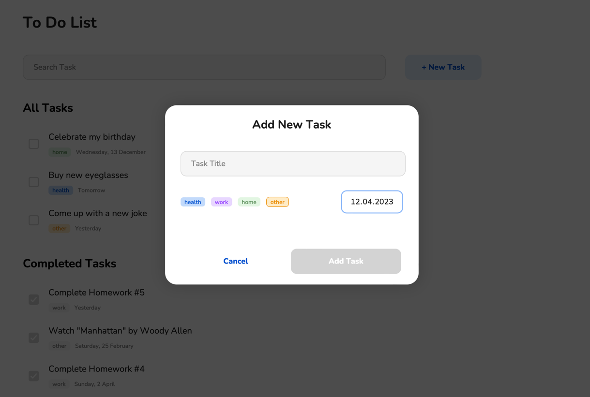
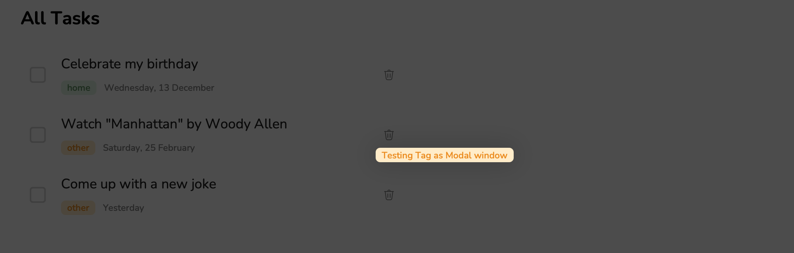
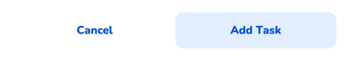
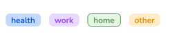
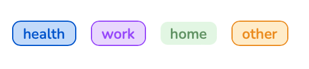

# Quantori Homework #5

### Git, DOM, OOP

---

**Main Branch:** <a href="https://mordvintsevmv.github.io/quantori_homework_5" target="_blank">Open page</a>

**Description:** *The main branch of the app.*

---

**Functional ToDo Branch:** <a href="https://quantori-hw5-feature-functional.netlify.app/" target="_blank">Open page</a>

**Description:** *ToDo List using Functional Components.*

---

**OOP ToDo Branch:** <a href="https://quantori-hw5-feature-oop.netlify.app/" target="_blank">Open page</a>

**Description:** *ToDo List using Class Components.*

---

### Developed:

- [X] ToDo List with Functional Components
- [X] ToDo List with Class Components
- [X] Responsive design for all versions
- [X] Saving Task Items to the localStorage
- [X] Class Components saves state of children components

**The application was tested on a variety of devices (iOS, MacOS, Windows, Android) and browsers (Safari, Chrome, Firefox) manually.**

**More information about the components and solutions is provided in the documentation.**

---


## <a name="content">Content</a>

1. [Task](#Task)
2. [Project Structure](#structure)
3. [Technical Solutions](#solutions)
   1. [Task Object](#solutions-taskobject)
   1. [Storing items in localStorage](#solutions-localstorage)
   1. [Search Task](#solutions-search)
   1. [Save state of children components (OOP)](#solutions-oop-state)
4. [Components](#components)
5. [Contacts](#contacts)

---

## <a name="Task">Task</a>

## Basic requirements

### Implementation

Use either boilerplate from functional.js or components.js files.

You can update base classes as needed, but you must not use any frameworks or libraries, just plain JS.

### General layout

- App should have a header
- App should have a search field
- Next to the search field there should be a button to add a new task
- In the content section, there should be a list of all unfinished tasks
- Under the list of unfinished tasks, there should be a list of all finished tasks

### Scenario 1: Adding a new task

When the user clicks on the "Add task" button, a modal window should appear.
The modal window should have the following fields:
- Title
- Input field for the task title
- Cancel button
- Add button

When the user clicks on the "Add" button, the modal window should close and the task should be added to the list of unfinished tasks.

When the user clicks on the "Cancel" button, the modal window should close. No changes should be made to the task list.

### Scenario 2: Marking a task as finished

When the user sees an unfinished task in the list, they should be able to mark it as finished by clicking on the checkbox next to the task title.

When the user clicks on the checkbox, the task should be moved to the list of finished tasks.

### Scenario 3: Deleting a task

When the user sees a task in the list, they should be able to delete it by clicking on the "Delete" button next to the task title.

When the user clicks on the "Delete" button, the task should be removed from the list.

### Scenario 4: Searching for a task

When the user types a search query into the search field, the list of unfinished tasks should be filtered by the search query.

Tasks are updated in real time as the user types the search query.


These are basic requirements and are worth 1 point. If they are not met, the homework will be rejected.

## UI improvements - 2 points

Make the app look like the mockups.

Please use only vanilla CSS. No CSS frameworks are allowed.

# Possible extensions

## Local storage - 2 points

Make app persistent.

Store the tasks in the local storage. When the user reloads the page, the tasks should be loaded from the local storage.

## Implement logic using both OOP and FP - 2 points

There are 2 examples on how to approach the app logic: functional and object-oriented.

If you implement logic using both approaches, you will get 2 points.

## Don't lose children's state on parent's rerender - 2 points

Current implementation of the class-based components lose state for their children.

I.e. if you have an input inside a list, and list rerenders, text in input will be lost.

Make a solution that will preserve state of children components.

---

## <a name="strucrute">Project Structure</a>

```
quantori_homework_5
│   README.md
│   404.html    
│   index.html    
│   og_image.png
│   .gitignore
│
└─── css - folder for all components style
│   │   Modal.css
│   │   Input.css
│   └─  ...
│   
└─── favicon - Favicons
│   │   favicon.ico
│   └─  ...
│
└─── functional - folder for all files of the Functional Components 
│   │   components - folder for all Components
│   └─  functional.js - all base functions for Functional Components
│
└─── oop - folder for all files of the Class Components
│   │   components - folder for all Components
│   └─  base_classes.js - base class for Class Components
│
└─── img - Images folder
│   │   checkbox-checked.svg
│   │   delete-new-value.svg
└   └─  ...
```

---

## <a name="solutions">Technical Solutions</a>

All the tasks were completed:
- [X] All the necessary functionality has been implemented;
- [X] The layout is made according to the Figma mockup
- [X] All Tasks stored in localStorage and loaded on page rendering
- [X] Both Functional and OOP Component were created
- [X] Class Components saves state of children components

---

### <a name="solutions-taskobject">Task Object</a>

---

### <a name="solutions-localstorage">Storing items in localStorage</a>

---

### <a name="solutions-search">Search Task</a>

---

### <a name="solutions-oop-state">Save state of children components (OOP)</a>

---

## <a name="components">Components</a>

All components were designed so that they could be reused in the future.

The decision to create a component was made based on the DRY principle - 
if an element was created manually too often (or may be created during further development), 
then a function (or class) was created instead, which generated the necessary element.

**The most interesting ones will be reviewed below**

---

### Modal

A modal window can be used often in an application. 

Therefore, it was decided to create a Component that accepts child HTML element 
and creates a modal window based on it.

```javascript
    // Creating Overlay to cover all page with dark background
    const overlay = document.createElement('div')
    overlay.classList.add('overlay')
    overlay.onclick = (event) => {
        closeModal()
    }

    // Modal Window with child Component
    const modal = document.createElement('div')
    modal.classList.add('modal')
    modal.onclick = (event) => {
        event.stopPropagation()
    }
    modal.append(children)
```

For example, as a child, we can pass a component "AddTask":



And also we can pass the Tag component there:




This approach will allow you to create modal windows for 
various situations in the future and not write a lot of repetitive code.

---

### Button

The application uses two types of buttons: 
with a blue background and with a transparent background. 
Therefore, it was decided not to create separate components for the buttons, 
but to add an additional parameter isTransparent (false by default).

```javascript
const Button = ({text, isTransparent = false, onClick}) => {
    const button = document.createElement("button");

    if (isTransparent) {
        button.classList.add('button--isTransparent')
    }
}
```

Example:



---

### CustomCheckInput

A lot of code was used to create a Radio Input for the tag, 
so it was decided to create a separate Сomponent, which return label element.


One of the possible improvements for the App - creating the feature to select multiple tags at once. 
Therefore, when creating this component, you can select the input type: checkbox or radio:

```javascript
const CustomCheckInput = ({type = 'radio', name, value, outline, isDefault = false, children}) => {
    
    const input = document.createElement('input')
    input.type = ['checkbox', 'radio'].includes(type) ? type : 'radio'
}
```

Radio Example:



CheckBox Example:



---

## <a name="contacts">Contacts</a>

**TG**: [@mordvintsevmv](https://t.me/mordvintsevmv)

**e-mail**: mordvintsevmv@gmail.com


[🔝Content🔝](#content)


